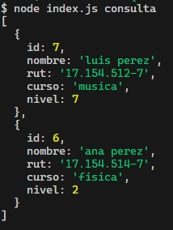

# Repositorio con el código solución al primer desafío del módulo 7

Este repositorio contiene el código solución del primer desafío del módulo 7 **Acceso a datos en aplicaciones Node**.

## Tabla de Contenido

- [Repositorio con el código solución al primer desafío del módulo 7](#repositorio-con-el-código-solución-al-primer-desafío-del-módulo-7)
  - [Tabla de Contenido](#tabla-de-contenido)
  - [Requisitos](#requisitos)
  - [Screenshots de Soluciones](#screenshots-de-soluciones)
    - [1-Registro exitoso de estudiante](#1-registro-exitoso-de-estudiante)
    - [2-Consulta exitosa de datos de estudiante en base a su Rut](#2-consulta-exitosa-de-datos-de-estudiante-en-base-a-su-rut)
    - [3-Consulta exitosa de todos los estudiantes registrados](#3-consulta-exitosa-de-todos-los-estudiantes-registrados)
    - [4-Edición exitosa de datos de estudiante](#4-edición-exitosa-de-datos-de-estudiante)
    - [5-Confirmación edición exitosa de datos de estudiante](#5-confirmación-edición-exitosa-de-datos-de-estudiante)
    - [6-Eliminación exitosa de datos de estudiante en la base de datos](#6-eliminación-exitosa-de-datos-de-estudiante-en-la-base-de-datos)
    - [7-Verificación de eliminación exitosa de datos de estudiante](#7-verificación-de-eliminación-exitosa-de-datos-de-estudiante)
  - [Resolución](#resolución)
    - [Configuración de Conexión con la base de datos](#configuración-de-conexión-con-la-base-de-datos)
    - [Escucha de comandos en consola](#escucha-de-comandos-en-consola)
    - [1. Crear una función asíncrona para registrar un nuevo estudiante en la base de datos. (2 puntos)](#1-crear-una-función-asíncrona-para-registrar-un-nuevo-estudiante-en-la-base-de-datos-2-puntos)
    - [2. Crear una función asíncrona para obtener por consola el registro de un estudiante por medio de su rut. (2 puntos)](#2-crear-una-función-asíncrona-para-obtener-por-consola-el-registro-de-un-estudiante-por-medio-de-su-rut-2-puntos)
    - [3. Crear una función asíncrona para obtener por consola todos los estudiantes registrados. (2 puntos)](#3-crear-una-función-asíncrona-para-obtener-por-consola-todos-los-estudiantes-registrados-2-puntos)
    - [4. Crear una función asíncrona para actualizar los datos de un estudiante en la base dedatos. (2 puntos)](#4-crear-una-función-asíncrona-para-actualizar-los-datos-de-un-estudiante-en-la-base-dedatos-2-puntos)
    - [5. Crear una función asíncrona para eliminar el registro de un estudiante de la base de datos. (2 puntos)](#5-crear-una-función-asíncrona-para-eliminar-el-registro-de-un-estudiante-de-la-base-de-datos-2-puntos)

## Requisitos


## Screenshots de Soluciones

### 1-Registro exitoso de estudiante


### 2-Consulta exitosa de datos de estudiante en base a su Rut


### 3-Consulta exitosa de todos los estudiantes registrados


### 4-Edición exitosa de datos de estudiante


### 5-Confirmación edición exitosa de datos de estudiante


### 6-Eliminación exitosa de datos de estudiante en la base de datos


### 7-Verificación de eliminación exitosa de datos de estudiante



## Resolución

### Configuración de Conexión con la base de datos

El siguiente código me permite conectar a la base de datos local:

```js
const connectionString = `postgresql://${process.env.POSTGRES_USER}:${process.env.POSTGRES_PASSWORD}@${process.env.POSTGRES_HOST}:${process.env.POSTGRES_PORT}/${process.env.POSTGRES_DATABASE}`;

const config = {
  connectionString: connectionString,
  idleTimeoutMillis: 0,
  allowExitOnIdle: true,
};
const connection_pool = new Pool(config);
```

### Escucha de comandos en consola

En base a comandos ingresados en la consola se realizan diversas acciones en la base de datos. El manejo de comandos y ejecución de determinadas funciones lo realizo por medio del siguiente código:

```js
const arrayComandos = process.argv.slice(2);

if (arrayComandos[0]) {
  switch (arrayComandos[0]) {
    case "nuevo":
      ingresarEstudiante(arrayComandos, connection_pool);
      break;
    case "rut":
      consultarRut(arrayComandos, connection_pool);
      break;
    case "consulta":
      consultarTodosLosEstudiantes(connection_pool);
      break;
    case "editar":
      editarEstudiante(arrayComandos, connection_pool);
      break;
    case "eliminar":
      eliminarEstudiante(arrayComandos, connection_pool);
      break;
    default:
      console.log("Comando inválido");
  }
} else {
  console.log("Debes ingresar un comando");
}
```

Las funciones **ingresarEstudiante**, **consultarRut**, **consultarTodosLosEstudiantes**,**editarEstudiante** y **eliminarEstudiante** que se ejecutan en respuesta al ingreso de determinada data en la consola las procedo a explicar a continuación:

### 1. Crear una función asíncrona para registrar un nuevo estudiante en la base de datos. (2 puntos)

He creado la siguiente función que permite el ingreso de un nuevo estudiante a la base de datos:

```js
function ingresarEstudiante(arrayComandos, connection_pool) {
  if (
    arrayComandos[1] &&
    arrayComandos[2] &&
    arrayComandos[3] &&
    arrayComandos[4]
  ) {
    const nombre = arrayComandos[1];
    const rut = arrayComandos[2];
    const curso = arrayComandos[3];
    const nivel = arrayComandos[4];
    insertEstudiantetoDatabase(connection_pool, nombre, rut, curso, nivel);
  } else {
    console.log(
      `Falta la data de ingreso para: ${arrayComandos[1] ? "" : "nombre"} ${
        arrayComandos[2] ? "" : "rut"
      } ${arrayComandos[3] ? "" : "curso"} ${arrayComandos[4] ? "" : "nivel"}`,
    );
  }
}
```

La función anterior hace uso de la siguiente función asíncrona **insertEstudiantetoDatabase** la cual insertar la data en la base de datos. Esta función maneja la lógica de inserción en la base de datos por medio de la librería **pg**:

```js
async function insertEstudiantetoDatabase(pool, nombre, rut, curso, nivel) {
  try {
    const text =
      "insert into estudiantes (nombre,rut,curso,nivel) values ($1, $2,$3, $4)";
    const values = [nombre, rut, curso, nivel];
    const response = await pool.query(text, values);
    if (response.rowCount == 1) {
      console.log(`Estudiante ${nombre} insertado con éxito`);
    }
  } catch (error) {
    console.log(error.message);
  }
}
```

### 2. Crear una función asíncrona para obtener por consola el registro de un estudiante por medio de su rut. (2 puntos)

He creado la siguiente función para consultar los datos de un estudiante por medio de su rut:

```js
function consultarRut(arrayComandos, connection_pool) {
  if (arrayComandos[1]) {
    const rut = arrayComandos[1];
    consultaRuttoDatabase(connection_pool, rut);
  } else {
    console.log("Debes ingresar un rut");
  }
}
```

Dicha función utiliza la siguiente función asíncrona que permite consultar los datos de un estudiante en base a su rut. Esta función maneja la lógica de la librería **pg** para consultar un estudiante en base a su rut:

```js
async function consultaRuttoDatabase(pool, rut) {
  try {
    const text = "select * from estudiantes where rut = $1";
    const values = [rut];
    const response = await pool.query(text, values);
    if (response.rowCount == 0) {
      console.log("Estudiante no encontrado");
    } else {
      console.log(response.rows);
    }
  } catch (error) {
    console.log(error);
  }
}
```

### 3. Crear una función asíncrona para obtener por consola todos los estudiantes registrados. (2 puntos)

He creado la siguiente función para obtener todos los estudiantes registrados:

```js
function consultarTodosLosEstudiantes(connection_pool) {
  consultaGlobaltoDatabase(connection_pool);
}
```

Dicha función utiliza la siguiente función asíncrona **consultaGlobaltoDatabase** que maneja la lógica de la librería **pg** para consultar todos los estudiantes registrados:

```js
async function consultaGlobaltoDatabase(pool) {
  try {
    const text = "select * from estudiantes";

    const response = await pool.query(text);
    if (response.rowCount == 0) {
      console.log("Estudiantes no encontrados");
    } else {
      console.log(response.rows);
    }
  } catch (error) {
    console.log(error);
  }
}
```

### 4. Crear una función asíncrona para actualizar los datos de un estudiante en la base dedatos. (2 puntos)

He creado la siguiente función **editarEstudiante** que permite editar un estudiante en la base de datos:

```js
function editarEstudiante(arrayComandos, connection_pool) {
  if (
    arrayComandos[1] &&
    arrayComandos[2] &&
    arrayComandos[3] &&
    arrayComandos[4]
  ) {
    const nombre = arrayComandos[1];
    const rut = arrayComandos[2];
    const curso = arrayComandos[3];
    const nivel = arrayComandos[4];
    editarEstudiantetoDatabase(connection_pool, nombre, rut, curso, nivel);
  } else {
    console.log(
      `Falta la Data de Edición para: ${arrayComandos[1] ? "" : "nombre"} ${
        arrayComandos[2] ? "" : "rut"
      } ${arrayComandos[3] ? "" : "curso"} ${arrayComandos[4] ? "" : "nivel"}`,
    );
  }
}
```

Dicha función utiliza la siguiente función asíncrona **editarEstudiantetoDatabase** para manipular la base de datos propiamente tal utilizando la librería **pg**:

```js
async function editarEstudiantetoDatabase(pool, nombre, rut, curso, nivel) {
  try {
    const text =
      "update estudiantes set nombre=$1, rut=$2, curso=$3, nivel=$4 where rut=$2";
    const values = [nombre, rut, curso, nivel];
    const response = await pool.query(text, values);
    if (response.rowCount == 1) {
      console.log(`Estudiante ${nombre} modificado con éxito`);
    }
    if (response.rowCount == 0) {
      console.log("Estudiante no encontrado");
    }
  } catch (error) {
    console.log(error.message);
  }
}
```

### 5. Crear una función asíncrona para eliminar el registro de un estudiante de la base de datos. (2 puntos)

He creado la función **eliminarEstudiante** que permite eliminar un estudiante en la base de datos en base a su rut:

```js
function eliminarEstudiante(arrayComandos, connection_pool) {
  if (arrayComandos[1]) {
    const rut = arrayComandos[1];
    eliminarEstudiantetoDatabase(connection_pool, rut);
  } else {
    console.log("Debes ingresar un rut");
  }
}
```

Dicha función utiliza la siguiente función asíncrona **eliminarEstudiantetoDatabase** que maneja la lógica de eliminación en la base de datos utilizando la librería **pg**:

```js
async function eliminarEstudiantetoDatabase(pool, rut) {
  try {
    const text = "delete from estudiantes where rut = $1";
    const values = [rut];
    const response = await pool.query(text, values);
    if (response.rowCount == 0) {
      console.log("Estudiante no encontrado");
    }
    if (response.rowCount == 1) {
      console.log(`Estudiante con rut ${rut} eliminado con éxito`);
    }
  } catch (error) {
    console.log(error.message);
  }
}
```
